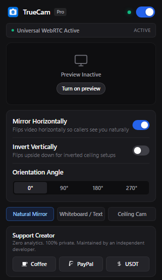
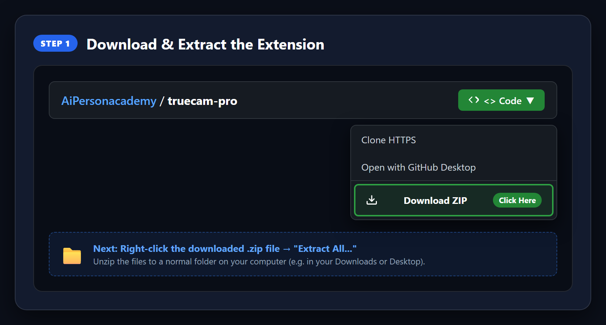
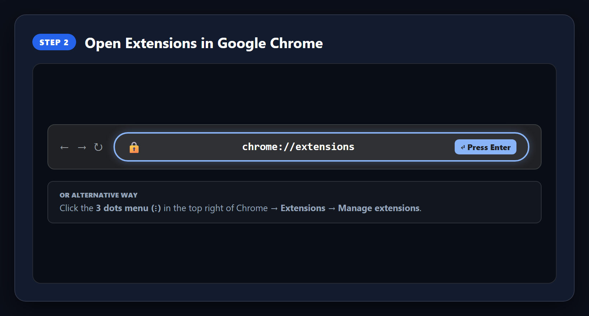
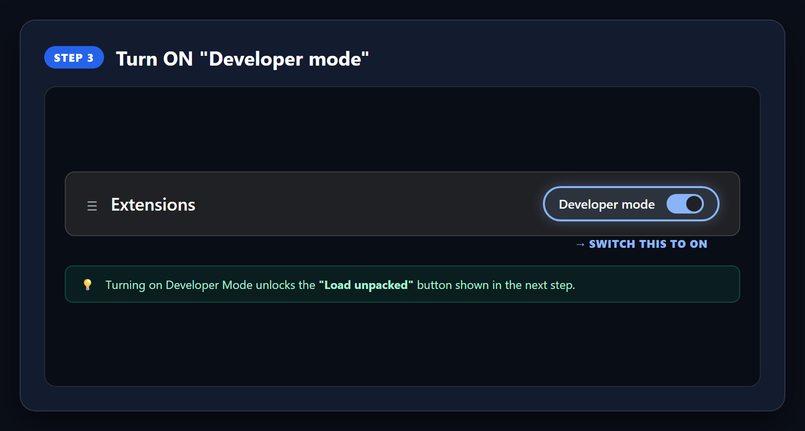
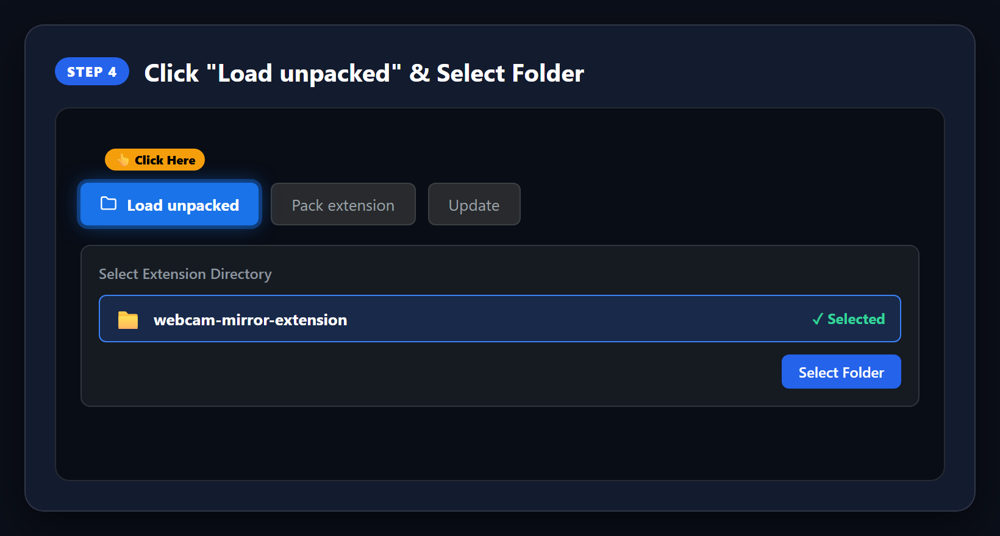
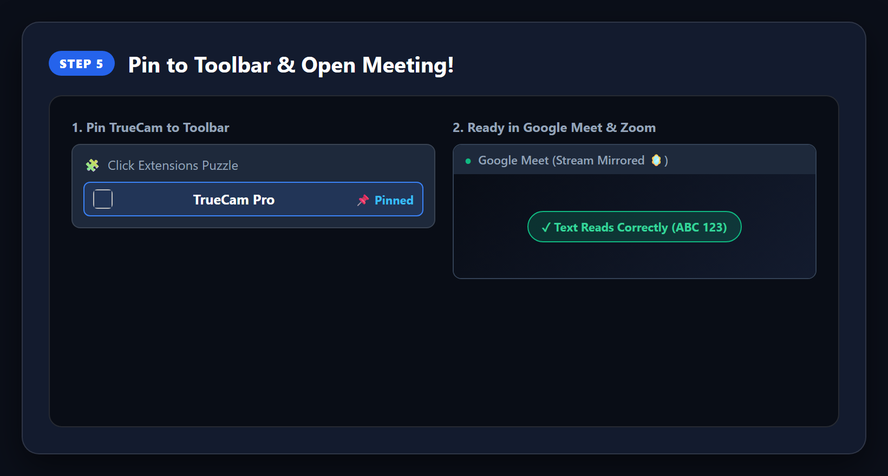

# TrueCam Pro 🪞

> **Hardware-Level WebRTC Webcam Stream Mirror, Flip & Rotation Extension**  
> *Engineered for Google Meet, Zoom Web, Microsoft Teams, Discord & Enterprise WebRTC Apps.*


<p align="center">
  
  
  
  
  <a href="https://buymeacoffee.com/ab2005"></a>
</p>

---

## 💡 The Problem TrueCam Solves

When you hold up notes, books, or write on a physical whiteboard during a Google Meet or Zoom call:
1. Most video conference tools **reverse or invert your video** to remote callers.
2. Naive browser extensions only apply a CSS `transform: scaleX(-1)` to your personal preview box on your screen — **callers still see backwards, unreadable text!**
3. Desktop virtual cameras (like OBS Studio or ManyCam) require heavy background software, virtual driver installations, and consume massive CPU/GPU resources.

**TrueCam Pro fixes this at the browser's hardware stream layer.**  
It intercepts `navigator.mediaDevices.getUserMedia` before video packets are encoded and transmitted. What you see is guaranteed to be what all remote attendees and recordings receive.

---

## 🖥️ Sleek Native Apple-Style Interface

<p align="center">
  
</p>

- **Zinc Neutral Design**: Clean, distraction-free macOS / Raycast aesthetic.
- **1-Click Presets**:
  - `Natural Mirror`: Natural reflection for facial camera view.
  - `Whiteboard / Text`: Unmirrored raw view so handwritten notes and book pages are 100% legible to attendees.
  - `Ceiling Cam`: 180° vertical inversion for upside-down webcam boom arms.
- **4-Way Angle Rotation**: `0°`, `90°`, `180°`, `270°` for portrait screens and mobile rigs.
- **Live HUD Monitor**: Compact 16:9 preview viewport with real-time resolution and framerate tracking (`1080p • 30fps`).

---

## 🛠️ Easy Step-by-Step Installation Guide (No Tech Skills Needed!)

Installing TrueCam Pro takes less than **60 seconds**. Works seamlessly on **Google Chrome, Brave, Microsoft Edge, Opera, and Vivaldi**.

---

### Step 1: Download & Extract the Folder
You do **not** need to use git or any terminal commands.

1. Click the green **`<> Code`** button at the top right of this GitHub page.
2. Click **Download ZIP**.
3. Locate the downloaded file (`truecam-pro-main.zip`) in your **Downloads** folder.
4. **Right-click** it and select **Extract All...** (or Unzip).

<p align="center">
  
</p>

---

### Step 2: Open Extensions in Google Chrome
1. Open Google Chrome (or your favorite Chromium browser).
2. Type or paste this into your browser's address bar at the top:
   ```text
   chrome://extensions
   ```
3. Press **Enter** on your keyboard.  
   *(If you use Microsoft Edge, type `edge://extensions` instead).*

<p align="center">
  
</p>

---

### Step 3: Turn On "Developer mode"
1. Look at the **top-right corner** of your Extensions page.
2. Find the toggle labeled **Developer mode**.
3. Click it so it turns **blue (ON)**.

<p align="center">
  
</p>

---

### Step 4: Click "Load unpacked" & Select the Folder
1. In the **top-left corner**, click the **Load unpacked** button.
2. A file window will pop up. Navigate to the extracted folder: `webcam-mirror-extension`.
3. Click **Select Folder**.

<p align="center">
  
</p>

---

### Step 5: Pin TrueCam & Start Your Meeting!
1. Click the **puzzle piece icon** (🧩) in the top-right toolbar of Chrome.
2. Click the **Pin icon** (📌) next to **TrueCam Pro** so it stays visible.
3. Open **Google Meet, Zoom, Teams, or Discord**.
4. Click the **TrueCam Pro icon** anytime to switch between **Natural Mirror**, **Whiteboard / Text**, or rotate your camera!

<p align="center">
  
</p>

---

## 🎥 How to Use in Meetings

1. **Open Google Meet, Zoom, or Teams** in your browser.
2. Click the **TrueCam icon** in your extensions toolbar.
3. Select your desired preset:
   - Click **Natural Mirror** for video meetings.
   - Click **Whiteboard / Text** when holding physical books or handwritten documents to the camera.
   - Click **Ceiling Cam** if your camera is mounted upside-down.
4. Turn on your webcam in the meeting — **your stream is instantly mirrored for all participants!**

---

## 🔬 Built-In Diagnostic Studio

TrueCam includes a standalone diagnostic lab to verify pixel stream manipulation without joining a real meeting:
1. Open the TrueCam popup.
2. Click **"Diagnostic Studio"** at the bottom.
3. Inspect real-time stream resolution, FPS counter, microphone audio levels, and capture instant pixel snapshots.

---

## 🔒 Security & Privacy Invariants

- **100% Client-Side**: Operates entirely in your browser's local memory.
- **Zero Cloud Processing**: Video and audio data are never uploaded to any remote server.
- **No Trackers or Analytics**: Zero third-party telemetry, zero cookies, zero data collection.

---

## ☕ Support Independent Development

TrueCam Pro is 100% free, tracker-free, and independently developed. If it saves you time in meetings, classes, or presentations, you can support development:

- **Buy Me a Coffee**: [buymeacoffee.com/ab2005](https://buymeacoffee.com/ab2005)
- **PayPal**: [paypal.me/boukhrisaymane](https://paypal.me/boukhrisaymane)
- **USDT (TRON Network / TRC-20)**:
  ```text
  TNWXzQRWcBhs3yutz7XMhu4UpN1xkHDwWW
  ```

---

## 📄 License
MIT License © 2026 Aymane Boukhris.
